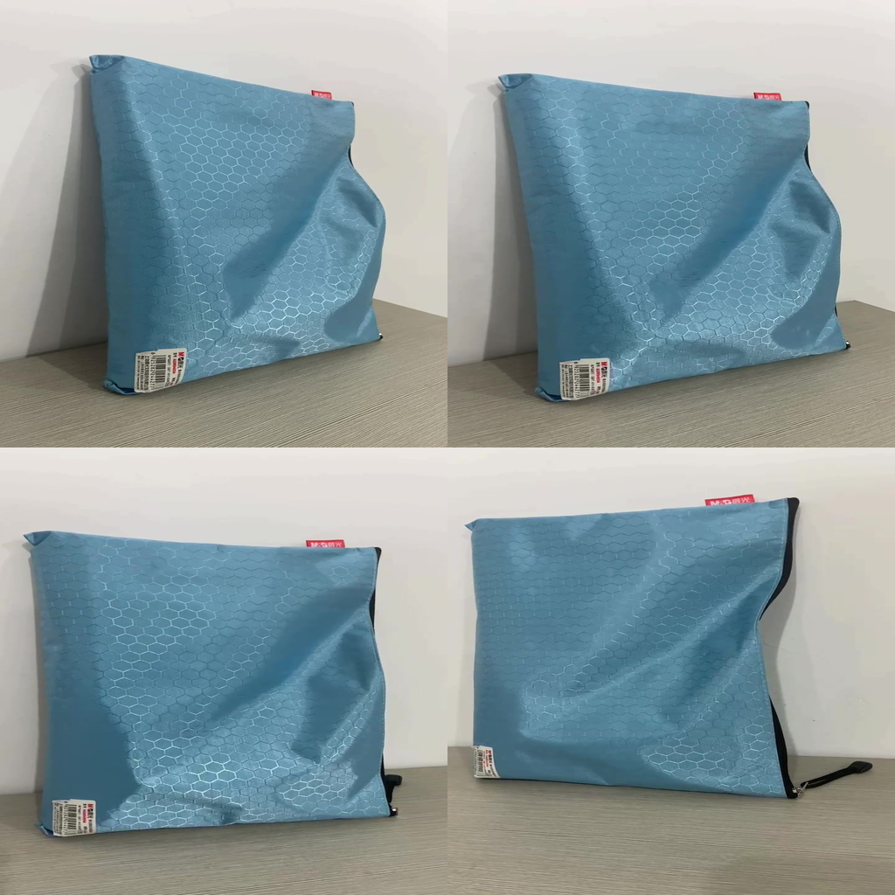

# Multi-Image Generation with In-Context LoRA

This repo aims to generate coherent 2D multi-view scenes (multiple images with intrinsic relationships, such as different viewpoints of the same object or scene) using minimal training data and limited compute. The approach builds on In-Context LoRA, a method to adapt diffusion transformer (DiT) models to multi-image outputs without changing the model architecture.

The key idea is to concatenate multiple images into one larger image during training, use a joint caption describing all sub-images, and fine-tune only lightweight LoRA adapters on a small dataset (on the order of 10–100 image sets). This enables high-fidelity multi-image generation that adheres well to the prompt, even with limited data.

# 1. Dataset Preparation (Multi-View Image Sets)
Collect or curate a small set of multi-view image groups. Each group should contain a few images that are related – e.g. different views of the same object or scene, or a sequence of images with a consistent theme or identity. You can use an existing multiview dataset like [MVImgNet](https://github.com/GAP-LAB-CUHK-SZ/MVImgNet) as a source: MVImgNet contains multi-view images of ~220k real-world objects across 238 classes.The goal for an MVP is a minimal viable dataset so about 10–20 image sets are sufficient (each set might have e.g. 2–4 images of a given object/scene from various angles or contexts) according to (In-Context LoRA paper)[https://ali-vilab.github.io/In-Context-LoRA-Page/]. I used 126 images from MVImgNet, which I selected in a spaced way to ensure a different viewpoint for each image in a set.

# 2.Automatic Caption Generation for Multi-Image Scenes

`python -m src.captioner.py` is a script that generates captions for multi-image sets.

For each image set, we need a single descriptive caption that encompasses all views/images. Writing these by hand is possible but to ensure scalability and consistency, we can automate caption generation using multimodal models:

I used Gemini 2.0 Flash to generate captions for each image set. After testing a bit with the captioning I find it the prompt is better when the images have already been concatenated into a single composite image. 

Example composite single composite image:



**Example caption for a composite image:**
``` 
[FOUR-VIEWS] This set of four images show different angles of a light blue bag with a hexagonal pattern; [TOP-LEFT] This photo shows a side view of the bag leaning against a wall; [TOP-RIGHT] This photo shows another side view of the bag; [BOTTOM-LEFT] This photo shows a front view of the bag; [BOTTOM-RIGHT] This photo shows a back view of the bag.
```

Example (two-view caption): “[TWO-VIEWS] This set of two images presents a scene from two different viewpoints. [IMAGE1] The first image shows a living room with a sofa, side tables, a television, houseplants, wall decor, and a rug. [IMAGE2] The second image shows the same room from another angle, revealing additional details from the other side.” This consistency helps the model learn the structure of multi-image prompts. The position tokens don’t carry inherent meaning, but during training the model will learn to associate them with positioning of sub-images. The captions should read like a single narrative or list of observations rather than disconnected sentences.

# 3. Preprocessing: Composite Images and Merged Prompts
 `python -m src.dataset_builder` is a script that processes the multi-image sets and captions to create the training data for the model and saves each composite image as a file and put the caption text in a .txt file with the same name.

Example data structure: *train_data/scene01.jpg... train_data/scene01.txt.*


Turn each multi-image set into the paired training data for the model.
- **Concatenate Images**: Concatenate the images in each set into a single larger image. For example, for two images, you can place them side by side or one above the other, for four images, a 2×2 grid is convenient otherwise one long line of concatenated images might take too much memory. Ensure the composite image has a consistent size and aspect ratio across your dataset. The idea is to mimic how the model will output multiple images in one go. Arrange images in a consistent order and orientation (the order should match the order in your caption). Add minimal spacing or dividing lines if needed (but typically just concatenating directly is fine so the model sees one continuous image).

 - **Composite image dimensions**: Choose a fixed size for composite images, e.g. 512x1024 for two images side by side, or 1024x1024 for four images in a grid. This ensures uniformity and helps the model learn to generate multi-image outputs. You can also stack vertically or in grid; just ensure your caption format corresponds (e.g., if you do a vertical stack of three, maybe use [TOP], [MIDDLE], [BOTTOM] markers or [IMAGE1]/[IMAGE2]/[IMAGE3] in top-to-bottom order). Keep in mind the final composite size affects memory usage during training, so choose a size that fits your GPU memory limits. Aso sometimes it might not be smart to try to fit your images into a fixed aspect radio, e.g. like a square one 512x512 as I have done, as this might distort the images too much.


# 4. Fine-tuning In-Context LoRA on the FLUX model
To train the model, we will use the In-Context LoRA approach on a diffusion transformer model like FLUX.

LoRA (Low-Rank Adaptation) inserts trainable low-rank weight matrices into the model (typically into attention layers) and freezes the original model weights. This drastically reduces the number of parameters that need updating (and thus memory usage), making it feasible to train on a single high-end GPU.

I trained a LoRA adapter on the FLUX model using the prepared multi-image dataset using the repository [AI-toolkit](https://github.com/ostris/ai-toolkit) and used as inspiration the [In-Context LoRA](https://github.com/ali-vilab/In-Context-LoRA/tree/main) config file.

I added my own LoRA config file `config_4views.yaml` to the `ai_toolkit/configs` directory. This config file specifies the LoRA parameters, including the rank, dropout, and target layers for adaptation.